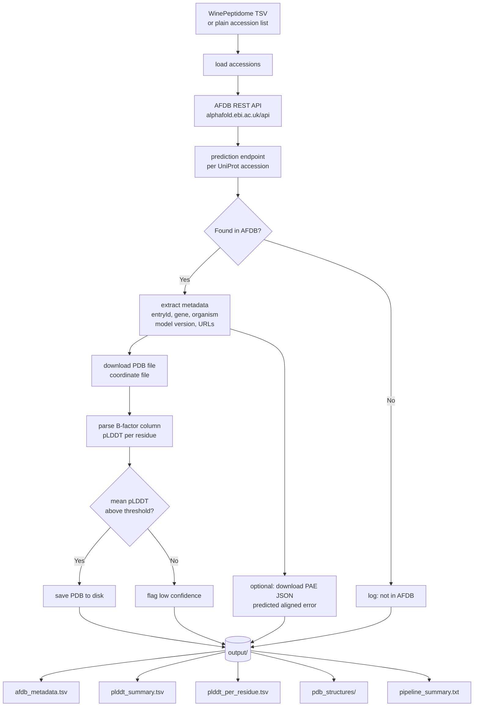

# 🧬 Wine Structure — AlphaFold Pipeline for Wine Lees Peptides

> *Step 2 of the Wine Peptidome series — programmatic retrieval of predicted 3D structures, pLDDT confidence scores and PAE matrices from the AlphaFold Database, applied to yeast and grapevine proteins from wine lees.*

[](https://www.python.org/)
[](LICENSE)
[](https://alphafold.ebi.ac.uk/api)
[](https://www.ebi.ac.uk)
[](https://orcid.org/0000-0002-7720-3733)

---

## 🍷 Where this fits in the Wine Peptidome series

This is **Step 2** of a two-script programmatic pipeline for wine lees research:

| Step | Repository | What it does |
|---|---|---|
| **1** | [WinePeptidome](https://github.com/314Olamda/WinePeptidome) | Retrieves all *S. cerevisiae* & *V. vinifera* proteins (500 Da – 100 kDa) from UniProt REST API + Proteins API. Outputs UniProt accessions, sequences, experimental peptide evidence, PTM sites. |
| **2** | **WineStructure** ← you are here | Takes those accessions into the AlphaFold Database API. Downloads predicted 3D structures, per-residue pLDDT confidence, and PAE matrices. |

Feed the output of Step 1 directly into Step 2:

```
WinePeptidome/output/uniprot_kb_entries.tsv  →  alphafold_wine_structures.py
```

---

## 🔬 Why structures matter for wine lees peptides

Wine lees — the yeast-rich sediment from fermentation — release bioactive peptides through autolysis during *sur lies* aging. These peptides exhibit antifungal activity against grapevine pathogens (*Phaeoacremonium minimum*, *Phaeomoniella chlamydospora*) that cause Petri disease. Knowing their predicted 3D structure enables:

- **Epitope mapping** — identify surface-exposed antifungal regions
- **Docking studies** — target pathogen cell wall proteins in silico
- **Activity correlation** — link structured vs. disordered regions to experimental bioactivity data (DPPH, MIC assays)
- **MSCA PROPEPT context** — structural annotation supports CRISPR-engineered yeast peptidomics design

---

## 🧬 Pipeline Architecture



---

## ⚡ Quick start

```bash
# 1. Clone
git clone https://github.com/314Olamda/WineStructure.git
cd WineStructure

# 2. Install dependency
pip install requests

# 3. Point to your accession source (edit INPUT_FILE in the script)
#    Option A — use WinePeptidome output directly (default):
#      INPUT_FILE = Path("../WinePeptidome/output/uniprot_kb_entries.tsv")
#
#    Option B — plain text file, one accession per line:
#      INPUT_FILE = Path("my_accessions.txt")

# 4. Run
python alphafold_wine_structures.py
```

---

## ⚙️ Configuration

All adjustable parameters are grouped at the top of the script:

```python
INPUT_FILE   = Path("../WinePeptidome/output/uniprot_kb_entries.tsv")
ACC_COLUMN   = "Entry"      # column name in WinePeptidome TSV

PLDDT_MIN    = 50.0         # skip PDB download if mean pLDDT below this
DOWNLOAD_PDB = True         # download PDB coordinate files
DOWNLOAD_PAE = False        # download PAE JSON matrices (larger files)
```

---

## 📦 Output files

| File | Content |
|---|---|
| `afdb_metadata.tsv` | One row per accession: gene, organism, model version, pLDDT stats, PDB/PAE URLs |
| `plddt_summary.tsv` | Confidence summary per structure: mean/min/max pLDDT, % high-confidence residues, confidence tier |
| `plddt_per_residue.tsv` | Per-residue pLDDT scores extracted from PDB B-factor column |
| `pdb_structures/` | Downloaded PDB files, one per accession |
| `pipeline_summary.txt` | Run statistics and accessions not found in AFDB |

---

## 📊 pLDDT confidence tiers

| pLDDT | Tier | Interpretation for peptide research |
|---|---|---|
| ≥ 90 | Very high | Backbone + side chains reliable; use for docking |
| 70–90 | Confident | Backbone correct; side-chain uncertainty — use with caution for docking |
| 50–70 | Low | Treat as rough backbone only |
| < 50 | Very low | Likely intrinsically disordered; may still be biologically relevant |

Low pLDDT in wine lees peptides is not always a negative result — intrinsically disordered regions are known to mediate antifungal membrane disruption.

---

## 🔗 Series & related resources

- **Step 1:** [WinePeptidome](https://github.com/314Olamda/WinePeptidome) — UniProt retrieval pipeline
- [AlphaFold Database API documentation](https://alphafold.ebi.ac.uk/api-docs)
- [EBI AlphaFold programmatic access tutorial](https://www.ebi.ac.uk/training/online/courses/alphafold) — source for API patterns used here
- [GNPS molecular networking](https://gnps.ucsd.edu/) — for experimental peptidomics annotation
- [reLees project](https://relees.uniwa.gr) — wine lees circular economy research

---

## 📄 Citation

```bibtex
@software{gimenez_gil_wine_structure_2025,
  author  = {Giménez-Gil, Pol},
  title   = {Wine Structure: AlphaFold Pipeline for Wine Lees Peptides},
  year    = {2025},
  url     = {https://github.com/314Olamda/WineStructure},
  orcid   = {0000-0002-7720-3733},
  note    = {Part of the Wine Peptidome series. Step 1: github.com/314Olamda/WinePeptidome}
}
```

---

## 👤 Author

**Pol Giménez-Gil**, PhD  
Postdoctoral Researcher — ISVV, Université de Bordeaux  
Scopus ID: 57219336109 · ORCID: [0000-0002-7720-3733](https://orcid.org/0000-0002-7720-3733)  
ResearchGate: [Pol_Gimenez2](https://www.researchgate.net/profile/Pol_Gimenez2)

---

## 📜 License

MIT — see [LICENSE](LICENSE)
